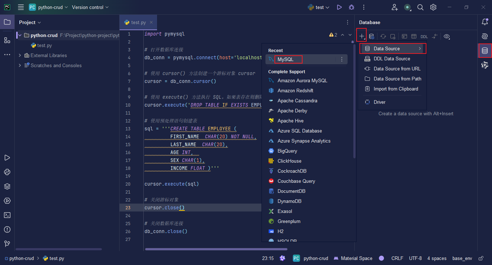
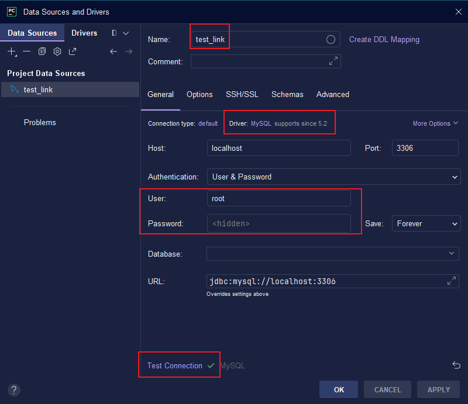
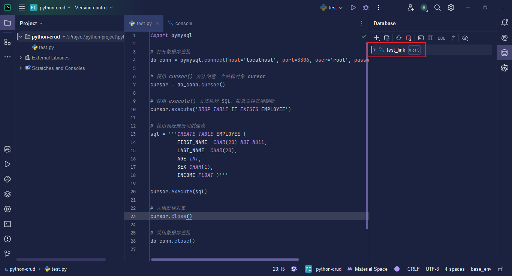

# Python CRUD

## PyMySQL

1.   创建 MySQL 服务的连接对象；
2.   使用连接对象创建一个游标对象；
3.   使用游标对象管理 CRUD 操作的上下文；

### Connection Object

创建连接对象

```python
import pymysql

# 打开数据库连接
db_conn = pymysql.connect(host='localhost', port=3306, user='root', password='root', db='test_db')  # `localhost` 可以使用回环地址 `127.0.0.1` 代替，同时不建议大家在项目中直接使用 `root` 超级管理员账号访问数据库

# 打印数据库连接对象
print(db_conn)  # <pymysql.connections.Connection object at 0x000001BB985C14F0>

# 关闭数据库连接
db_conn.close()

```

#### 查看 MySQL 版本号

```python
import pymysql

# 打开数据库连接
db_conn = pymysql.connect(host='localhost', port=3306, user='root', password='root', db='test_db')

# 使用 cursor() 方法创建一个游标对象 cursor
cursor = db_conn.cursor()

# 使用 execute()  方法执行 SQL 查询
cursor.execute("SELECT VERSION()")

# 使用 fetchone() 方法获取单条数据.
data = cursor.fetchone()

print("Database version : %s " % data)  # Database version : 8.0.12

# 关闭游标对象
cursor.close()

# 关闭数据库连接
db_conn.close()

```

### 创建数据表

```python
import pymysql

# 打开数据库连接
db_conn = pymysql.connect(host='localhost', port=3306, user='root', password='root', db='test_db')

# 使用 cursor() 方法创建一个游标对象 cursor
cursor = db_conn.cursor()

# 使用 execute() 方法执行 SQL，如果表存在则删除
cursor.execute('DROP TABLE IF EXISTS EMPLOYEE')

# 使用预处理语句创建表
sql = '''CREATE TABLE EMPLOYEE (
         FIRST_NAME  CHAR(20) NOT NULL,
         LAST_NAME  CHAR(20),
         AGE INT,  
         SEX CHAR(1),
         INCOME FLOAT )'''

cursor.execute(sql)

# 关闭游标对象
cursor.close()

# 关闭数据库连接
db_conn.close()

```

> 说明：在 PyCharm 中书写 SQL 语句的地方，如果提示如下警告 `No data sources are configured to run this SQL and provide advanced code assistance.`，不会影响编码，但如果强迫症如我，可以 `Configure data source`，也就是添加一个数据库连接配置以消除该警告信息。
>
> 
>
> 
>
> 

### CRUD

> CRUD（创建：Create、读取：Read、更新：Update、删除：Delete）。
>
> 如果执行 `insert`、`delete` 或 `update` 操作，需要根据实际情况提交或回滚事务。因为创建连接时，默认开启了事务环境，在操作完成后，需要使用连接对象的 `commit` 或 `rollback` 方法，实现事务的提交或回滚，`rollback` 方法通常会放在异常捕获代码块 `except` 中。

#### 插入数据

##### 插入单条记录

```python
import pymysql

# 打开数据库连接
db_conn = pymysql.connect(host='localhost', port=3306, user='root', password='root', db='test_db')

# SQL 插入语句
sql = """INSERT INTO EMPLOYEE(FIRST_NAME,
         LAST_NAME, AGE, SEX, INCOME)
         VALUES ('Mac', 'Mohan', 20, 'M', 2000)"""
try:
    # 使用 cursor() 方法创建一个游标对象 cursor
    # 通过游标对象向数据库服务器发出 SQL 语句
    with db_conn.cursor() as cursor:
        # 执行 SQL 语句
        cursor.execute(sql)
    # 提交事务到数据库执行
    db_conn.commit()
except pymysql.MySQLError as err:
    # 如果发生错误则回滚事务
    db_conn.rollback()

# 关闭数据库连接
db_conn.close()

```

##### 插入多条记录

```python
import pymysql

with pymysql.connect(host='localhost', user='root', passwd='root', db='test_db') as db_conn:
    # SQL 语句的参数以元组形式组织
    data = [
        ('Jackie', 'Chan', 50, 'M', 5000),
        ('Jet', 'Li', 40, 'M', 4000),
        ('Jay', 'Chou', 35, 'F', 3000),
    ]

    sql = """INSERT INTO EMPLOYEE(FIRST_NAME, LAST_NAME, AGE, SEX, INCOME) VALUES (%s, %s, %s, %s, %s)"""

    try:
        with db_conn.cursor() as cursor:
            # 将以列表形式组织的多条记录传递给 SQL 语句批量执行
            cursor.executemany(sql, data)
        db_conn.commit()
    except pymysql.MySQLError as err:
        db_conn.rollback()

```

#### 更新数据

```python
import pymysql

# 打开数据库连接
with pymysql.connect(host='localhost', port=3306, user='root', password='root', db='test_db') as db_conn:
    # SQL 更新语句
    sql = "UPDATE EMPLOYEE SET AGE = AGE + 1 WHERE FIRST_NAME = %s" % 'Mac'
    try:
        # 使用 cursor() 方法创建一个游标对象 cursor
        # 通过游标对象向数据库服务器发出 SQL 语句
        with db_conn.cursor() as cursor:
            # 执行 SQL 语句
            cursor.execute(sql)
        # 提交事务到数据库执行
        db_conn.commit()
    except pymysql.MySQLError as err:
        # 如果发生错误则回滚事务
        db_conn.rollback()

```

#### 删除数据

```py
import pymysql

# 打开数据库连接
with pymysql.connect(host='localhost', port=3306, user='root', password='root', db='test_db') as db_conn:
    try:
        # 使用 cursor() 方法创建一个游标对象 cursor
        # 通过游标对象向数据库服务器发出 SQL 语句
        with db_conn.cursor() as cursor:
            # 执行 SQL 语句
            affected_row = cursor.execute(
                "DELETE FROM EMPLOYEE WHERE FIRST_NAME = %s",
                'Mac'
            )
            if affected_row == 1:
                print('删除成功')
        # 提交事务到数据库执行
        db_conn.commit()
    except pymysql.MySQLError as err:
        # 如果发生错误则回滚事务
        db_conn.rollback()

```

#### 查询数据

##### 查询单条记录

```python
import pymysql

# 打开数据库连接
with pymysql.connect(host='localhost', port=3306, user='root', password='root', db='test_db') as db_conn:
    try:
        # 使用 cursor() 方法创建一个游标对象 cursor
        # 通过游标对象向数据库服务器发出 SQL 语句
        with db_conn.cursor() as cursor:
            # 执行 SQL 语句
            cursor.execute("SELECT * FROM EMPLOYEE")
            row = cursor.fetchone()
            # print(row)  # 单次输出单条
            while row:  # 循环输出多条
                print(row)
                row = cursor.fetchone()
    except pymysql.MySQLError as err:
        # print(type(err), err)
        print("Error: unable to fetch data")

```

##### 查询多条记录

```py
import pymysql

# 打开数据库连接
with pymysql.connect(host='localhost', port=3306, user='root', password='root', db='test_db') as db_conn:
    try:
        # 使用 cursor() 方法创建一个游标对象 cursor
        # 通过游标对象向数据库服务器发出 SQL 语句
        with db_conn.cursor() as cursor:
            # 执行 SQL 语句
            cursor.execute("SELECT * FROM EMPLOYEE")
            rows = cursor.fetchall()
            for row in rows:
                print(row)
    except pymysql.MySQLError as err:
        # print(type(err), err)
        print("Error: unable to fetch data")

```

### 总结（固定模板）

```python
# 1. 导入库
import pymysql

# 2. 创建与服务的连接
with pymysql.connect(host='localhost', port=3306, user='root', password='root', db='test_db') as db_conn:
    # 3. 创建游标对象
    with db_conn.cursor() as cursor:
        # 4. 定义 SQL 语句
        # 插入、查询、修改、删除
        sql = ''
        # 5. 使用 try...except 执行 SQL 语句并捕获异常
        try:
            # 6. 插入单条数据、查询数据、修改数据、删除数据，均使用 execute
            # 插入多条数据使用 executemany
            cursor.execute(sql)
            
            # 8.1. 如果是插入数据、修改数据、删除数据，会有受影响的行数，可以以此给用户提示
            # affected_row = cursor.execute(sql)
            # if affected_row > 0:
            #     print('提示信息')
            
            # 7.1. 单条打印 fetchone
            # row = cursor.fetchone()
            # # 通过 while 循环实现了一个批量打印的效果
            # while row:
            #     print(row)
            #     row = cursor.fetchone()
            # 7.2. 批量打印 fetchall
            rows = cursor.fetchall()
            # print(rows)
            for row in rows:
                print(row)
                
            # 8.2. 如果是插入数据、修改数据、删除数据，需要提交事务
            # db_conn.commit()
        except pymysql.MySQLError as err:
            print(err)
            # 发生异常后需要回滚事务
            # db_conn.rollback()

```

## SQLAlchemy
